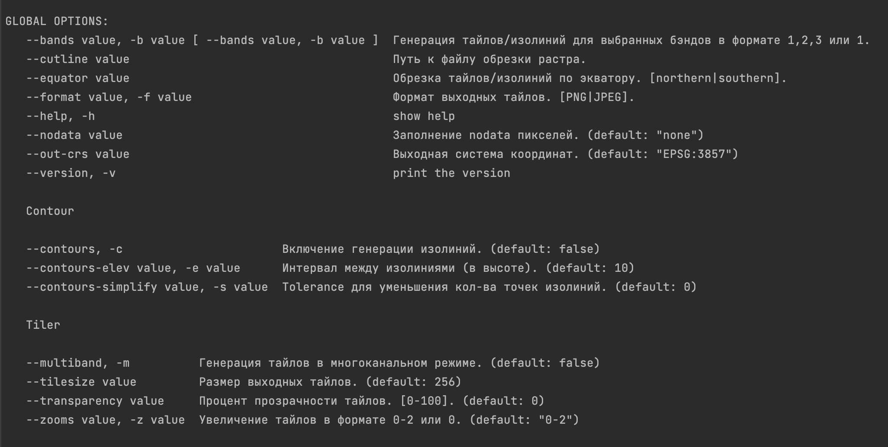

# My GRIB Tiler Go

## Content:
0. [Status](#status)
1. [Pre-Requirements](#prereq)
2. [Run options](#run)
3. [Workflow](#workflow)
4. [Flags](#flag)

## Status
1. [x] Генерация тайлов
2. [x] Поддержка многоканальных тайлов
3. [x] Генерация изолиний в разных CRS
4. [x] Генерация линий экватора
5. [x] Поддержка сutline файлов

## Pre requirements

---

- Systems:
    - OS Linux 22.04/ MacOS 13.0.0
    - Golang 1.20+
- Environments 
    - Anaconda env 
    _or_ 
    - Brew
- Libraries
    - GDAL 3.6.4+
    - Proj 9.2.0+
    - gcc

---
## Run options
- *Скомпилированный бинарный файл* 
  &#10071; [ВАЖНО] бинарный файл собирался и тестировался на arm64 архитектуре(apple m1). ~~При проблемах с запуском может потребоваться пересобрать образ под конкретную архитектуру~~. UPD: доступны бинарники под обе архитектуры 
  Наиболее простой способ запуска. Имеется уже собранный бинарный файл, который читает флаги или загружает конфиг.
    - Пример `$ ./grib-tiler -d ./my_gribs -o ./my_result -z 0-2 -b 682,695 --out-crs EPSG:3857` _или_
- *Локальный запуск* 
    Способ для локальной развертки и интеграций с другими сервисами. 
    Путь до конфига и другие параметры можно так же указывать флагами. По умолчанию конфиг в `./config.yaml`
    - Установить зависимости `$ go mod download`
    - Для запуска `$ go run cmd/main.go`
- *Docker* 
    На данный момент не очень удобный способ, но тоже имеет место быть.
    - `$ docker build . -t my-grib-tiler-go`
    - `$ docker run my-grib-tiler-go`

---
## Workflow
По умолчанию входные файлы ищутся в папке `./data`, если не указана другая опция. Поддерживаются форматы `grib2`, `tif`, `vrt`.

Результат (тайлы `256х256`) пишется в папку `./result` в формате `./result/{filename}/{type}/{band|random int}/{zoom}/{x}/{y}.png`.

## Flags
Доступные флаги
